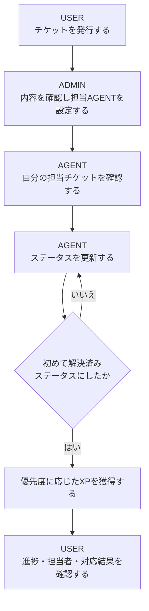
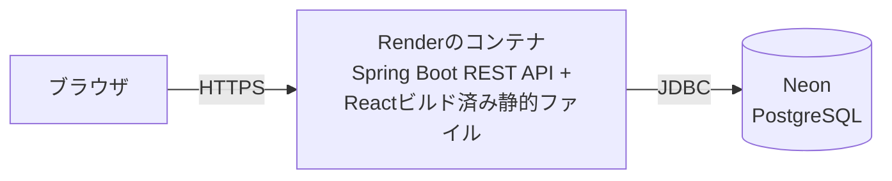
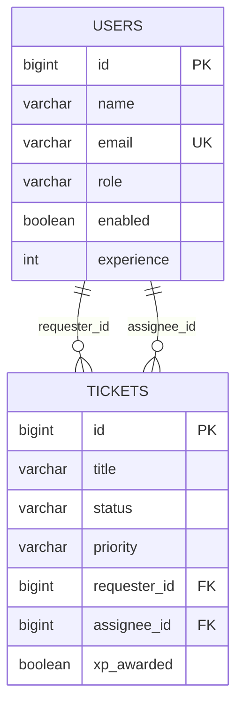

# chikecan（チケカン）

USER・AGENT・ADMINの3つの役割でチケットのやり取りを行う、業務用チケット管理Webアプリです。単なる問い合わせ管理にとどまらず、AGENTが対応したチケットに応じてXP（経験値）とレベルが上がるゲーム的なモチベーション要素を組み合わせている点が特徴です。

個人のポートフォリオとして、要件定義・設計・実装・テスト・デプロイまでを一人で通しで行いました。

## 目次

- [公開URL](#公開url)
- [基本的な利用の流れ](#基本的な利用の流れ)
- [ロール別の機能](#ロール別の機能)
- [主な機能](#主な機能)
- [XP・レベル機能](#xpレベル機能)
- [技術スタック](#技術スタック)
- [システム構成](#システム構成)
- [バックエンドの処理構成](#バックエンドの処理構成)
- [セキュリティ設計](#セキュリティ設計)
- [DB設計](#db設計)
- [API概要](#api概要)
- [ローカル環境での起動方法](#ローカル環境での起動方法)
- [環境変数](#環境変数)
- [テスト](#テスト)
- [工夫した点](#工夫した点)
- [今後の改善案](#今後の改善案)
- [ライセンス・注意事項](#ライセンス注意事項)

## 公開URL

**https://chikecan.onrender.com/**

Renderの無料インスタンスで稼働しているため、しばらくアクセスがないとスリープ状態になり、初回アクセス時の表示に時間がかかることがあります。あらかじめご了承ください。

## 基本的な利用の流れ

chikecanは、社内問い合わせ対応のような「依頼 → 割り当て → 対応 → 完了確認」という業務フローをそのままアプリの機能に落とし込んでいます。

1. **USER**が、問い合わせや作業依頼の内容をチケットとして発行する
2. **ADMIN**がチケット内容を確認し、対応する**AGENT**を担当者として設定する
3. **AGENT**が、自分に割り当てられたチケットを一覧で確認する
4. **AGENT**が対応状況に合わせてステータスを更新する（未対応 → 対応中 → 解決済み → クローズ）
5. チケットが初めて「解決済み」になったタイミングで、優先度に応じたXPをAGENTが獲得する
6. **USER**は、自分が発行したチケットの進捗と担当者をいつでも確認できる



## ロール別の機能

| ロール | 主な操作 | 閲覧できるチケット |
| --- | --- | --- |
| USER | チケットの新規作成、自分が発行したOPENチケットの編集、進捗・担当者の確認 | 自分が発行したチケットのみ |
| ADMIN | 全チケットの閲覧、担当AGENTの設定・解除、ステータス更新 | 管理対象として全チケット |
| AGENT | ステータス更新、対応によるXP獲得 | 自分が担当に設定されているチケットのみ |

ロールによる制御は画面上でボタンや項目を隠すだけではなく、バックエンドのController（`@PreAuthorize`によるロール確認）とService（チケットの依頼者ID・担当者IDによる所有者確認）の両方で行っています。フロントエンドの表示制御を回避してAPIへ直接リクエストしても、権限外の操作は拒否されます。

## 主な機能

- ユーザー登録・ログイン・ログアウト・ログイン状態の確認
- セッションCookieによる認証
- CSRF対策（トークンの発行とヘッダー送信）
- ロールに応じた画面表示・API認可
- チケットの新規作成
- チケット一覧・詳細の表示
- USER本人によるOPENチケットのタイトル・内容・優先度の編集
- ADMINによる担当AGENTの設定・解除
- AGENT・ADMINによるチケットステータスの更新
- 依頼者名・担当者名の表示（メールアドレスは表示しない）
- 1ページ20件のサーバーサイドページネーション
- チケット一覧から詳細へ移動したあと、元のページ位置へ戻れる導線
- 登録日時のブラウザローカル時刻での表示
- AGENT向けのXP・レベル・進捗バー表示
- XP獲得時・レベルアップ時のマスコットアニメーション演出
- スマートフォン幅を含むレスポンシブ対応

## XP・レベル機能

AGENTの「対応した実感」を可視化するための独自機能です。

**優先度ごとの獲得XP**

| 優先度 | 獲得XP |
| --- | --- |
| LOW | 10 |
| MEDIUM | 20 |
| HIGH | 30 |

**XPが付与される条件**

- チケットのステータスが初めて「解決（RESOLVED）」になったタイミングでのみ判定する
- 判定時点でそのチケットに担当者（AGENT）が設定されている場合のみ、その担当者へXPを付与する
- 担当者が未設定、またはUSER・ADMINが担当者に設定されている場合はXPを付与しない
- 一度「初回解決」の判定を行ったチケットは、その後「対応中に戻す → 再度解決する」を繰り返してもXPを再付与しない（判定済みであること自体をチケット側に記録しており、実際に付与できたかどうかとは別に管理している）
- 判定後に担当者を変更しても、過去に付与したXPを移動・取り消ししない

**累計XPからのレベル算出**

累計XP（`experience`）だけをDBへ保存し、レベルや残りXPは保存せずに次の式で都度計算します（`ExperienceLevel`クラス、1レベルあたり100XP）。

```text
level                 = experience / 100 + 1
currentLevelExperience = experience % 100
experienceToNextLevel  = 100 - currentLevelExperience
```

**表示・演出**

- XPパネルに現在レベル・累計XP・次のレベルまでのXP・進捗バーを表示し、AGENT以外には表示しない
- 進捗バーはCSSアニメーションで滑らかに伸び、レベルをまたぐ場合は「旧レベル分まで伸びる → リセット → 新レベル分まで伸びる」という2段階の動きで表現する
- チケット型のオリジナルマスコット画像（アイドル・XP獲得・レベルアップの3状態）を用意し、通常のXP獲得より、レベルアップ時のほうが演出（星・光・紙吹雪などのCSS装飾）を大きくして違いを分かりやすくしている
- 演出は`aria-live`で内容を通知し、`prefers-reduced-motion`が有効な環境では動きを抑えた表示に切り替える

**同時更新への対策**

ステータス更新はDB行の悲観ロック（`SELECT ... FOR UPDATE`相当）を取得したうえで行い、同じチケットに対する複数の同時リクエストを直列化することで、XPの二重付与を防いでいます。このロックはステータス更新の処理経路だけに限定しており、チケット一覧や詳細取得などほかの参照処理には影響しません。

## 技術スタック

**フロントエンド**

| 技術 | 用途 |
| --- | --- |
| React ^19.2.8 | UI構築 |
| TypeScript ~6.0.2 | 型安全な開発 |
| Vite ^8.3.0 | 開発サーバー・ビルド |
| React Router ^7.18.4 | ルーティング・画面遷移 |

**バックエンド**

| 技術 | 用途 |
| --- | --- |
| Java 21 | 実行環境 |
| Spring Boot 4.1.1 | REST API・DI |
| Spring Security | 認証・認可・CSRF |
| Spring Data JPA | DBアクセス |
| Flyway | DBマイグレーション |

**データベース**

| 技術 | 用途 |
| --- | --- |
| PostgreSQL（Neon） | 本番環境のデータベース |
| H2 | ローカル開発・自動テスト用のインメモリDB |

**インフラ**

| 技術 | 用途 |
| --- | --- |
| Docker | フロント・バックエンドを1イメージへまとめるマルチステージビルド |
| Render | 本番環境のホスティング |

**テスト**

| 技術 | 用途 |
| --- | --- |
| Spring Boot Test / MockMvc | バックエンドの単体・結合テスト |
| JUnit 5 / Mockito / AssertJ | バックエンドのテストフレームワーク（Spring Boot 4.1.1が管理するバージョンを使用） |
| Vitest ^5.0.1 | フロントエンドのテストランナー |
| React Testing Library ^16.3.3 | フロントエンドのコンポーネントテスト |

バージョンは各`pom.xml`・`package.json`から確認できる範囲のみ記載しています。

## システム構成



本番環境ではDockerのマルチステージビルドで、React（`frontend`）をビルドしてSpring Boot（`backend`）の静的リソースへ組み込み、1つのjarとしてビルドしています。これによりブラウザからはフロントとAPIが同一オリジンとなり、本番ではCORS設定が実質的に不要になっています。

ローカル開発時は、React開発サーバー（`http://localhost:5173`）とSpring Boot（`http://localhost:8080`）を別オリジンで起動し、データベースはH2のインメモリDBを使用します。

## バックエンドの処理構成

Controller → Service → Repository → Databaseという責務分担を徹底しています。

- **Controller**: リクエスト・レスポンスの受け渡しと`@PreAuthorize`によるロール単位の認可のみを担当し、業務ロジックを持たない
- **Service**: ロール確認、依頼者ID・担当者IDによる所有者確認、複数Repository操作のとりまとめを担当する
- **Repository**: Spring Data JPAによるDBアクセスのみを担当する

設計上の工夫として、以下を行っています。

- EntityをAPIレスポンスとして直接返さず、`TicketResponse`・`UserResponse`などのDTOへ変換して公開する
- `User`エンティティのパスワードハッシュは`@JsonIgnore`で、担当AGENT候補一覧（`AgentSummaryResponse`）はID・名前のみで構成し、メールアドレスを含めない
- チケット一覧では、ページ内チケットの依頼者ID・担当者IDをSetへ集約し、`findAllById`で1回のクエリにまとめて名前解決することでN+1問題を避けている
- 一覧のページネーションは、全件取得後にJavaで分割するのではなく、Spring Data JPAの`Pageable`をRepositoryのクエリ段階で使用している
- 並び順は登録日時の降順を基本とし、同一日時でも順序が安定するようIDの降順を第2条件に加えている
- チケットのステータス更新とXP付与は同一トランザクション内で行い、XPの二重付与は「初回解決の判定フラグ」と「悲観ロックによる直列化」の組み合わせで防いでいる

## セキュリティ設計

- **セッションCookie認証**: トークンをフロントで管理する方式ではなく、Spring Securityの標準的なセッションCookie（`JSESSIONID`）による認証を採用し、`HttpOnly`・`SameSite=Lax`を設定している。本番環境（HTTPS）ではCookieの`Secure`属性を有効化し、ローカル環境（HTTP）では無効化するよう、Spring Profileで切り替えている
- **CSRF対策**: `CookieCsrfTokenRepository`でCSRFトークンをCookieへ発行し、フロントエンドが`/api/auth/csrf`で取得したトークンを`X-XSRF-TOKEN`ヘッダーへ載せて送信する。無効化せず有効なまま利用している
- **CORS**: ローカル開発用に`http://localhost:5173`のみを許可し、`allowCredentials`を有効化している。本番はフロントとAPIが同一オリジンのため、この設定は開発時のみ意味を持つ
- **パスワード保護**: BCryptでハッシュ化して保存し、平文パスワードをログや画面へ出力しない
- **ロール別認可**: `@PreAuthorize`によるURL単位の制御に加えて、Service層でも「本人のチケットか」「自分が担当のチケットか」をIDで確認している
- **IDOR対策**: 「存在しないチケット」と「他人のチケット」を区別できるレスポンスにしないよう、`findByIdAndRequesterId`・`findByIdAndAssigneeId`のようにID＋所有者IDを同時に条件とする検索を使い、どちらの場合も同じ404を返す
- **公開情報の最小化**: `/api/auth/me`は本人の情報としてメールアドレスを返すが、ADMINが担当AGENTを選ぶための一覧APIはID・名前のみを返し、メールアドレスを含めない
- **ユーザー登録の制限**: 一般公開されている登録APIから作成できるアカウントは常にUSERロールに固定されており、AGENT・ADMINの権限を自己登録で得ることはできない

## DB設計

FlywayマイグレーションとEntityから確認できる主要テーブルです（詳細な型・制約はマイグレーションファイルを参照してください）。



| テーブル | 用途 |
| --- | --- |
| `users` | アカウント情報（ロール、有効フラグ、累計XPを含む） |
| `tickets` | チケット情報（ステータス、優先度、依頼者・担当者のID、XP判定済みフラグを含む） |

マイグレーションは`V1__create_users_table.sql`（usersテーブル作成）、`V2__create_tickets_table.sql`（ticketsテーブル作成）、`V3__add_agent_experience_and_ticket_xp_tracking.sql`（累計XPとXP判定フラグの追加）の3ファイルで管理しています。

## API概要

| メソッド | エンドポイント | 認証・ロール | 用途 |
| --- | --- | --- | --- |
| GET | `/api/health` | 不要 | 稼働確認 |
| GET | `/api/auth/csrf` | 不要 | CSRFトークン取得 |
| POST | `/api/auth/register` | 不要 | ユーザー登録（USER固定） |
| POST | `/api/auth/login` | 不要 | ログイン |
| POST | `/api/auth/logout` | 不要（呼び出し時点で未ログインでも安全） | ログアウト |
| GET | `/api/auth/me` | 認証済み | ログイン中ユーザー情報・XP/レベルの取得 |
| POST | `/api/tickets` | USER | チケット作成 |
| GET | `/api/tickets` | 認証済み（ロールにより取得範囲が変わる） | チケット一覧（`page`・`size`によるページネーション） |
| GET | `/api/tickets/{id}` | 認証済み（所有者・担当者・ADMIN） | チケット詳細 |
| PATCH | `/api/tickets/{id}` | USER（本人のOPENチケットのみ） | チケット編集 |
| PATCH | `/api/tickets/{id}/status` | AGENT, ADMIN | ステータス更新（初回解決時にXP判定） |
| PATCH | `/api/tickets/{id}/assignee` | ADMIN | 担当者の設定・解除 |
| GET | `/api/admin/agents` | ADMIN | 担当AGENT候補一覧（ID・名前のみ） |

## ローカル環境での起動方法

以下はWindows PowerShellでの手順です。

**必要なバージョン**

- Java 21（LTS）
- Node.js 24（LTS。Viteが要求する`^20.19.0 || >=22.12.0`を満たすバージョン）
- npm（Node.jsに同梱のもの）

**バックエンド**

```powershell
cd backend
.\mvnw.cmd spring-boot:run
```

追加の環境変数設定は不要です。デフォルトのSpringプロファイル（`local`）でH2のインメモリDBを使用するため、本番用のPostgreSQL接続情報（`DB_URL`など）はローカル起動には必要ありません。起動後は `http://localhost:8080` でAPIへアクセスできます。

**フロントエンド**

```powershell
cd frontend
npm install
npm run dev
```

`frontend/.env.example`を参考に、`frontend/.env.development`（Git管理対象外）を作成し、次の値を設定してください。

```text
VITE_API_BASE_URL=http://localhost:8080
```

起動後は `http://localhost:5173` で画面を確認できます。

## 環境変数

実際の値は記載していません。名前と用途のみ示します。

| 変数名 | 用途 | 参照ファイル |
| --- | --- | --- |
| `PORT` | Renderなど、起動時にリッスンポートを指定するホスティング環境向け。未設定時は8080を使用する | `application.properties` |
| `SPRING_PROFILES_ACTIVE` | 有効化するSpring Profile（本番では`prod`を指定してPostgreSQL接続・Cookieの`Secure`属性を有効化する） | Render環境設定 |
| `DB_URL` | PostgreSQL接続URL（`prod`プロファイル使用時のみ必要） | `.env.example` / `application-prod.properties` |
| `DB_USERNAME` | PostgreSQL接続ユーザー名（`prod`プロファイル使用時のみ必要） | `.env.example` / `application-prod.properties` |
| `DB_PASSWORD` | PostgreSQL接続パスワード（`prod`プロファイル使用時のみ必要） | `.env.example` / `application-prod.properties` |
| `VITE_API_BASE_URL` | フロントエンドが呼び出すバックエンドのベースURL（ローカル開発で別オリジンのAPIを指定するため） | `frontend/.env.example` |

## テスト

**バックエンド**

```powershell
cd backend
.\mvnw.cmd test
```

本README作成時点で実行し、**186件全て成功**を確認しています。

**フロントエンド**

```powershell
cd frontend
npm test
npm run lint
npm run build
```

本README作成時点で実行し、テスト**168件全て成功**、lintエラーなし、ビルド成功を確認しています。

**主なテスト観点**

- 認証・認可（未認証・ロール不足時のアクセス拒否、CSRF検証）
- チケットの所有者・担当者確認（他人のチケットへのアクセス、編集不可な状態からの編集）
- ステータス遷移の可否
- 担当者の設定・解除
- XP付与条件（優先度別のXP、担当者なし・USER担当・ADMIN担当時の非付与、レベル到達）
- XPの二重付与防止（再解決時、担当者変更後の再解決時）と同時実行時のロック
- ページネーション（件数・ページ数・境界値、ロールごとの取得範囲）
- 登録日時のローカル時刻表示・担当者列の表示切り替え
- React Routerによる画面遷移（保護ルート、一覧⇄詳細間のページ位置維持）

## 工夫した点

- フロントエンドの表示制御とバックエンドの`@PreAuthorize`・所有者確認による二重の認可
- IDORを意識した、ID＋所有者IDを組み合わせたチケット取得
- 一覧取得時のユーザー名一括解決によるN+1問題の回避
- Repositoryのクエリ段階で行うDBサイドページネーション
- 判定済みフラグによるXPの二重付与防止
- 悲観ロック（行ロック）による、ステータス更新時のみの同時実行対策
- EntityとAPIレスポンス用DTOの分離
- APIレスポンスからの不要な個人情報（メールアドレス等）の除外
- URLクエリ（`?page=`）によるページ状態の保持と、一覧⇄詳細間の遷移元URLの引き継ぎ
- アクセシビリティ（`aria-live`、`aria-current`）と`prefers-reduced-motion`への対応

## 今後の改善案

- CI（GitHub Actionsなど）での自動テスト実行
- E2Eテストの追加
- チケット操作履歴・監査ログの記録
- ステータス変更・担当者設定時の通知機能
- チケット一覧のキーワード検索・条件絞り込み
- 本番環境の監視・アラート強化

## ライセンス・注意事項

このリポジトリにはライセンスファイルを設置しておらず、ライセンスは未設定です。ポートフォリオとしての閲覧・参考を目的として公開しています。
