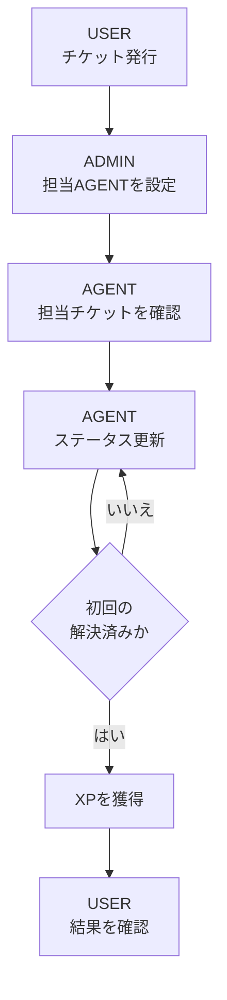
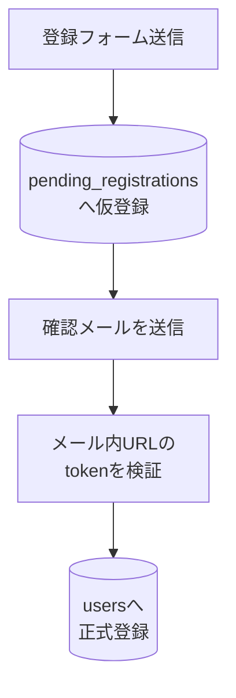
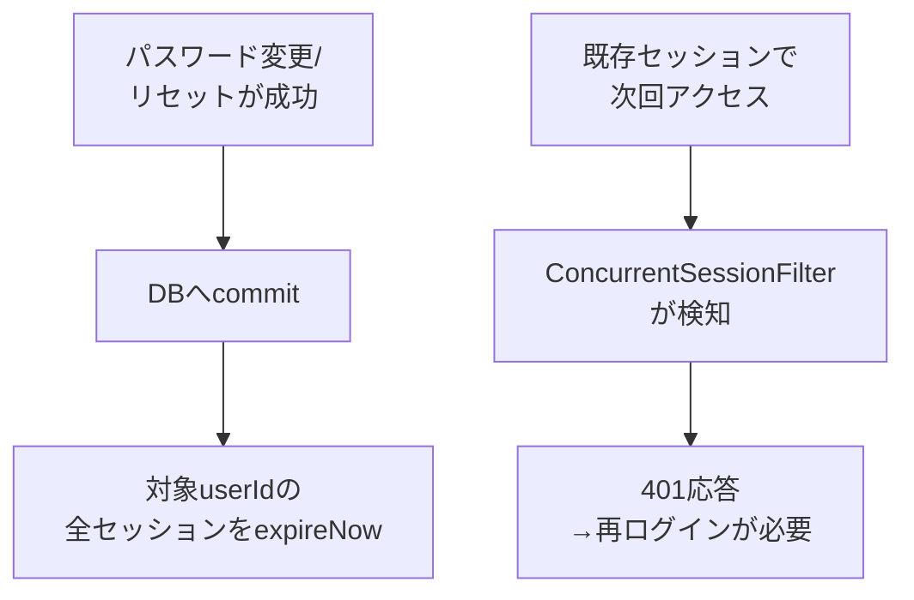
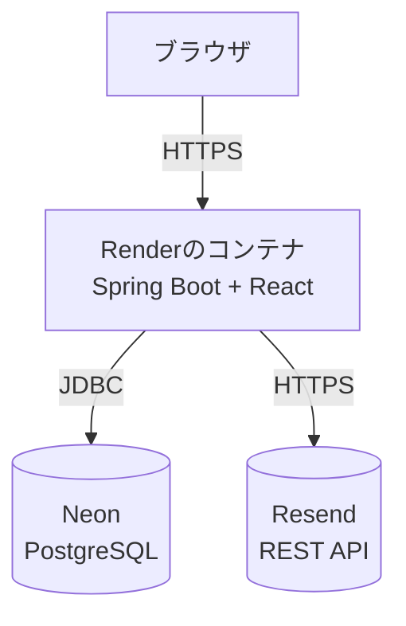

# chikecan（チケカン）

USER・AGENT・ADMINの3つの役割でチケットのやり取りを行う、業務用チケット管理Webアプリです。単なる問い合わせ管理にとどまらず、AGENTが対応したチケットに応じてXP（経験値）とレベルが上がるゲーム的なモチベーション要素を組み合わせている点が特徴です。React（TypeScript）とSpring Bootを組み合わせ、メールアドレス確認を伴うユーザー登録、セッションCookieによる認証、ロールに応じた認可など、実務を意識したセキュリティ設計にも取り組んでいます。

個人のポートフォリオとして、要件定義・設計・実装・テスト・デプロイまでを一人で通しで行いました。

## 目次

- [公開URL](#公開url)
- [基本的な利用の流れ](#基本的な利用の流れ)
- [ロール別の機能](#ロール別の機能)
- [主な機能](#主な機能)
- [認証・アカウント管理](#認証アカウント管理)
- [XP・レベル機能](#xpレベル機能)
- [技術スタック](#技術スタック)
- [システム構成](#システム構成)
- [バックエンドの処理構成](#バックエンドの処理構成)
- [メール送信の仕組み（Resend REST API）](#メール送信の仕組みresend-rest-api)
- [セキュリティ設計](#セキュリティ設計)
- [DB設計](#db設計)
- [API概要](#api概要)
- [ローカル環境での起動方法](#ローカル環境での起動方法)
- [環境変数](#環境変数)
- [テスト](#テスト)
- [本番環境での動作確認](#本番環境での動作確認)
- [工夫した点](#工夫した点)
- [今後の改善案](#今後の改善案)
- [ライセンス・注意事項](#ライセンス注意事項)

## 公開URL

- 公開アプリ（実際に操作できるデモ環境）: [https://chikecan.onrender.com/](https://chikecan.onrender.com/)
- ソースコード（GitHubリポジトリ）: [https://github.com/tomys4529/chikecan](https://github.com/tomys4529/chikecan)

公開アプリはRenderの無料インスタンスで稼働しているため、しばらくアクセスがないとスリープ状態になり、初回アクセス時の表示に時間がかかることがあります。あらかじめご了承ください。

## 基本的な利用の流れ

chikecanは、社内問い合わせ対応のような「依頼 → 割り当て → 対応 → 完了確認」という業務フローをそのままアプリの機能に落とし込んでいます。

1. **USER**が、メールアドレス確認を経てアカウントを作成し、問い合わせや作業依頼の内容をチケットとして発行する
2. **ADMIN**がチケット内容を確認し、対応する**AGENT**を担当者として設定する
3. **AGENT**が、自分に割り当てられたチケットを一覧で確認する
4. **AGENT**が対応状況に合わせてステータスを更新する（未対応 → 対応中 → 解決済み → クローズ）
5. チケットが初めて「解決済み」になったタイミングで、優先度に応じたXPをAGENTが獲得する
6. **USER**は、自分が発行したチケットの進捗と担当者をいつでも確認できる



## ロール別の機能

| ロール | 主な操作 | 閲覧できるチケット |
| --- | --- | --- |
| USER | チケットの新規作成、自分が発行したOPENチケットの編集、進捗・担当者の確認 | 自分が発行したチケットのみ |
| ADMIN | 全チケットの閲覧、担当AGENTの設定・解除、ステータス更新 | 管理対象として全チケット |
| AGENT | ステータス更新、対応によるXP獲得 | 自分が担当に設定されているチケットのみ |

ロールによる制御は画面上でボタンや項目を隠すだけではなく、バックエンドのController（`@PreAuthorize`によるロール確認）とService（チケットの依頼者ID・担当者IDによる所有者確認）の両方で行っています。フロントエンドの表示制御を回避してAPIへ直接リクエストしても、権限外の操作は拒否されます。

一般公開されている登録APIから作成できるアカウントは常にUSERロールに固定されており、AGENT・ADMINの権限を自己登録で得ることはできません。

## 主な機能

- メールアドレス確認を伴うユーザー登録・ログイン・ログアウト・ログイン状態の確認
- パスワードを忘れた場合の再設定（メールリンク経由）
- ログイン中のパスワード変更・メールアドレス変更（変更後は既存セッションを全端末で失効）
- 姓名を構造化して入力する氏名フォーム（日本向け／海外向け）
- セッションCookieによる認証
- CSRF対策（トークンの発行とヘッダー送信）
- ロールに応じた画面表示・API認可
- チケットの新規作成
- チケット一覧・詳細の表示
- USER本人によるOPENチケットのタイトル・内容・優先度の編集
- ADMINによる担当AGENTの設定・解除
- AGENT・ADMINによるチケットステータスの更新
- 依頼者名・担当者名の表示（メールアドレスは表示しない）
- 1ページ20件のサーバーサイドページネーション
- チケット一覧から詳細へ移動したあと、元のページ位置へ戻れる導線
- 登録日時のブラウザローカル時刻での表示
- AGENT向けのXP・レベル・進捗バー表示
- XP獲得時・レベルアップ時のマスコットアニメーション演出
- スマートフォン幅を含むレスポンシブ対応
- 入力値検証（文字数上限・必須項目・パスワード強度など）をフロントとバックエンドの両方で実施

> Reactは特別な対応をしなくてもJSX中の文字列を自動でエスケープして描画するため、`dangerouslySetInnerHTML`を使用しない本アプリでは、ユーザー入力（チケットのタイトル・内容など）がそのままHTMLとして解釈されることはありません。入力値を禁止文字で弾く実装は行わず、この既定の挙動をXSS対策として利用しています。

## 認証・アカウント管理

メールアドレス確認、パスワード再設定、メールアドレス変更、ログイン中のパスワード変更という4つの機能を、それぞれ独立したトークンテーブル（`pending_registrations`／`password_reset_tokens`／`email_change_requests`）で管理しています。

### メールアドレス確認を伴うユーザー登録

登録フォーム送信の時点では`users`へ保存せず、`pending_registrations`（仮登録）へ保存したうえで確認メールを送信します。メール内リンクのtokenが検証できた場合にのみ`users`へ正式登録し、`pending_registrations`の該当行を削除します。



- 確認前のアカウントは`users`テーブルに一切存在しない
- 仮登録の有効期限は24時間。期限切れの仮登録は次回登録時に遅延削除する
- トークンは生の値をDBへ保存せず、SHA-256でハッシュ化した値のみを保存する（`VerificationTokenGenerator`）
- パスワードは登録時点でBCryptハッシュ化してから仮登録に保存する
- 同じメールアドレスで再登録すると、既存の仮登録と古いトークンを上書きして無効化する
- 確認メールが届かない場合の再送フォームを用意している

### パスワード再設定

- メールアドレスを入力すると再設定メールを送信するが、**アカウントの存在有無に関わらず外部への応答は常に同じ**にすることでアカウント列挙（メールアドレスの在不在の推測）を防いでいる
- トークンの有効期限は1時間（メール認証より機密性が高いため短く設定）
- 生トークンは保存せずハッシュ化して保存し、使用済みトークンは削除する
- 再度リクエストすると古いトークンを上書きして無効化する
- 再設定成功時は対象ユーザーの既存セッションを全て失効させる（詳細は後述）

### ログイン中のパスワード変更・メールアドレス変更

ログイン後の「アカウント設定」画面（`AccountPage`）から、それぞれ独立したフォームで操作します。

- **パスワード変更**: 現在のパスワードの一致を必須とし、新しいパスワードが現在と同じ場合は拒否する。成功時は既存セッションを全て失効させ、フロントも直ちにログイン画面へ遷移する
- **メールアドレス変更**: `users.email`は即時更新せず、新しいメールアドレス宛に確認メールを送信する。メール内リンクのtokenが検証できた場合にのみ`users.email`を更新するため、画面上の表示中メールアドレスは確認完了まで変わらない
  - 現在のパスワードの入力を必須とする
  - 重複チェックは`users`・`pending_registrations`・他ユーザーの`email_change_requests`の3箇所に対して行い、Service層の事前確認に加えて`email_change_requests.new_email`のDB UNIQUE制約でも二重に防ぐ（同時リクエストによる競合はDB制約違反として捕捉し、409を返す）
  - 変更確定に成功すると、旧メールアドレス宛に発行済みだったパスワードリセットトークンを無効化する

### パスワード変更・リセット後の全セッション失効

パスワード変更・パスワードリセットが成功すると、対象ユーザーの既存セッション（操作中のセッション、他端末・他ブラウザのセッションを含む）を全て失効させ、再ログインを必須にします。同時ログイン数の制限（1人1セッションまで、等）は行っておらず、複数端末での同時ログイン自体は制限していません。



- Spring Securityの`SessionRegistry`でログイン中セッションをuserId単位に管理する
- ログインごとにDBから新しく生成される`AppUserDetails`インスタンスであっても、`equals`/`hashCode`をuserId基準でオーバーライドしているため、同一ユーザーの複数セッションを正しく1人分としてまとめられる
- `SessionInformation#expireNow()`はSessionRegistry上のフラグを立てるのみで、実際の強制ログアウトは次回そのセッションでリクエストが来た際に`ConcurrentSessionFilter`が検知して401を返す
- **ポートフォリオ上の設計ポイント**: セッション失効は、パスワード更新のDBコミットが確実に成功した後にのみ実行する。`TransactionSynchronizationManager`の`afterCommit`フックへ登録することで、トランザクションがロールバックされた場合はセッション失効自体を行わないようにしている。これにより「パスワードは更新されていないのに再ログインを強制される」という不整合を防いでいる

### 氏名の構造化入力

- 登録画面では入力形式を「日本向け（`JAPANESE`）」「海外向け（`INTERNATIONAL`）」から選択する
- JAPANESEは姓・名、INTERNATIONALはFirst name・Middle name（任意）・Last nameを個別に保存する
- 表示名の組み立ては`DisplayName.build(...)`に一本化し、`User`エンティティと`AppUserDetails`（セッション上のログイン情報）の両方から同じロジックを呼び出すことで表示のずれを防いでいる
- `LEGACY`はこの機能導入前から存在する、姓名を分割保存していないデータを表す区分で、新規登録では選択できない。既存の`name`列は削除せず、LEGACY判定時の表示にそのまま使う

## XP・レベル機能

AGENTの「対応した実感」を可視化するための独自機能です。

**優先度ごとの獲得XP**

| 優先度 | 獲得XP |
| --- | --- |
| LOW | 10 |
| MEDIUM | 20 |
| HIGH | 30 |

**XPが付与される条件**

- チケットのステータスが初めて「解決（RESOLVED）」になったタイミングでのみ判定する
- 判定時点でそのチケットに担当者（AGENT）が設定されている場合のみ、その担当者へXPを付与する
- 担当者が未設定、またはUSER・ADMINが担当者に設定されている場合はXPを付与しない
- 一度「初回解決」の判定を行ったチケットは、その後「対応中に戻す → 再度解決する」を繰り返してもXPを再付与しない（判定済みであること自体をチケット側に記録しており、実際に付与できたかどうかとは別に管理している）
- 判定後に担当者を変更しても、過去に付与したXPを移動・取り消ししない

**累計XPからのレベル算出**

累計XP（`experience`）だけをDBへ保存し、レベルや残りXPは保存せずに次の式で都度計算します（`ExperienceLevel`クラス、1レベルあたり100XP）。

```text
level                 = experience / 100 + 1
currentLevelExperience = experience % 100
experienceToNextLevel  = 100 - currentLevelExperience
```

**表示・演出**

- XPパネルに現在レベル・累計XP・次のレベルまでのXP・進捗バーを表示し、AGENT以外には表示しない
- 進捗バーはCSSアニメーションで滑らかに伸び、レベルをまたぐ場合は「旧レベル分まで伸びる → リセット → 新レベル分まで伸びる」という2段階の動きで表現する
- チケット型のオリジナルマスコット画像（アイドル・XP獲得・レベルアップの3状態）を用意し、通常のXP獲得より、レベルアップ時のほうが演出（星・光・紙吹雪などのCSS装飾）を大きくして違いを分かりやすくしている
- 演出は`aria-live`で内容を通知し、`prefers-reduced-motion`が有効な環境では動きを抑えた表示に切り替える

**同時更新への対策**

ステータス更新はDB行の悲観ロック（`SELECT ... FOR UPDATE`相当）を取得したうえで行い、同じチケットに対する複数の同時リクエストを直列化することで、XPの二重付与を防いでいます。このロックはステータス更新の処理経路だけに限定しており、チケット一覧や詳細取得などほかの参照処理には影響しません。

## 技術スタック

**フロントエンド**

| 技術 | 用途 |
| --- | --- |
| React ^19.2.8 | UI構築 |
| TypeScript ~6.0.2 | 型安全な開発 |
| Vite ^8.3.0 | 開発サーバー・ビルド |
| React Router ^7.18.4 | ルーティング・画面遷移 |

**バックエンド**

| 技術 | 用途 |
| --- | --- |
| Java 21 | 実行環境 |
| Spring Boot 4.1.1 | REST API・DI |
| Spring Security | 認証・認可・CSRF・セッション管理 |
| Spring Data JPA | DBアクセス |
| Flyway | DBマイグレーション |
| Spring RestClient | Resend REST APIへのHTTP通信 |

**データベース**

| 技術 | 用途 |
| --- | --- |
| PostgreSQL（Neon） | 本番環境のデータベース |
| H2 | ローカル開発・自動テスト用のインメモリDB |

**外部サービス**

| 技術 | 用途 |
| --- | --- |
| Resend | メール認証・パスワード再設定・メールアドレス変更のメール送信（REST API） |

**インフラ**

| 技術 | 用途 |
| --- | --- |
| Docker | フロント・バックエンドを1イメージへまとめるマルチステージビルド |
| Render | 本番環境のホスティング |

**テスト**

| 技術 | 用途 |
| --- | --- |
| Spring Boot Test / MockMvc / MockRestServiceServer | バックエンドの単体・結合テスト、外部HTTP通信のモック |
| JUnit 5 / Mockito / AssertJ | バックエンドのテストフレームワーク（Spring Boot 4.1.1が管理するバージョンを使用） |
| Vitest ^5.0.1 | フロントエンドのテストランナー |
| React Testing Library ^16.3.3 | フロントエンドのコンポーネントテスト |

バージョンは各`pom.xml`・`package.json`から確認できる範囲のみ記載しています。

## システム構成



本番環境ではDockerのマルチステージビルドで、React（`frontend`）をビルドしてSpring Boot（`backend`）の静的リソースへ組み込み、1つのjarとしてビルドしています。これによりブラウザからはフロントとAPIが同一オリジンとなり、本番ではCORS設定が実質的に不要になっています。認証メール等の送信は、Spring BootからHTTPSでResendのREST APIを呼び出す構成です（理由は後述）。

ローカル開発時は、React開発サーバー（`http://localhost:5173`）とSpring Boot（`http://localhost:8080`）を別オリジンで起動し、データベースはH2のインメモリDBを使用します。メール送信も行わず、認証用URLをログへ出力するだけの動作になります。

## バックエンドの処理構成

Controller → Service → Repository → Databaseという責務分担を徹底しています。

- **Controller**: リクエスト・レスポンスの受け渡しと`@PreAuthorize`によるロール単位の認可のみを担当し、業務ロジックを持たない
- **Service**: ロール確認、依頼者ID・担当者IDによる所有者確認、複数Repository操作のとりまとめを担当する
- **Repository**: Spring Data JPAによるDBアクセスのみを担当する

設計上の工夫として、以下を行っています。

- EntityをAPIレスポンスとして直接返さず、`TicketResponse`・`UserResponse`などのDTOへ変換して公開する
- `User`エンティティのパスワードハッシュは`@JsonIgnore`で、担当AGENT候補一覧（`AgentSummaryResponse`）はID・名前のみで構成し、メールアドレスを含めない
- チケット一覧では、ページ内チケットの依頼者ID・担当者IDをSetへ集約し、`findAllById`で1回のクエリにまとめて名前解決することでN+1問題を避けている
- 一覧のページネーションは、全件取得後にJavaで分割するのではなく、Spring Data JPAの`Pageable`をRepositoryのクエリ段階で使用している
- 並び順は登録日時の降順を基本とし、同一日時でも順序が安定するようIDの降順を第2条件に加えている
- チケットのステータス更新とXP付与は同一トランザクション内で行い、XPの二重付与は「初回解決の判定フラグ」と「悲観ロックによる直列化」の組み合わせで防いでいる
- メール認証・パスワードリセット・メールアドレス変更のトークン発行/検証/更新/削除は、それぞれ単一のトランザクション内で行い、検証と同時に使用済みトークンを削除することで再利用を防いでいる

## メール送信の仕組み（Resend REST API）

当初はSpring Mail（JavaMailSender）によるSMTP送信を実装していましたが、Renderの無料プランでは外向きのSMTPポート（25/465/587）がブロックされており、本番環境からメールを送信できないことが分かりました。HTTPS（443番ポート）は通るため、SMTPからHTTPS REST APIベースのメール配信サービス「[Resend](https://resend.com)」経由の送信へ移行しています。

- `ResendMailClient`が`https://api.resend.com/emails`へのPOSTを一手に引き受け、`VerificationMailService`・`PasswordResetMailService`・`EmailChangeMailService`はそれぞれ件名・本文・URLの組み立てだけを担当する
- 認証はBearerトークン（APIキー）、ボディはJSON
- Spring Bootの`RestClient.Builder`が自動構成されない構成のため、`RestClient.builder()`を直接呼び出し、接続タイムアウト5秒・読み取りタイムアウト10秒を明示的に設定している
- 4xx/5xx・タイムアウト・接続エラー・レスポンスのJSONパースエラーは全て`RestClientException`としてまとめて捕捉し、ログに記録した上で例外を伝播させない。これにより、メール送信の失敗が呼び出し元（`UserService`の`@Transactional`メソッド）のDBトランザクションをロールバックさせることはない
- ローカル開発では`app.mail.enabled=false`のため実送信を行わず、確認用URLをログへ出力するだけにしている

### メールアドレス変更機能の動作確認状況

「本番でメールが送れるか」を単に言葉で説明するのではなく、確認済みの範囲を自動テストと本番環境とで分けて記載します。

**自動テストで確認済み（バックエンド）**

- 変更申請時にトークンが発行・保存されること
- 正しいトークンでの確定時に`users.email`が更新されること
- 無効・期限切れ・再利用されたトークルが拒否されること
- 変更成功時に旧メールアドレス宛のパスワードリセットトークンが無効化されること、かつ他ユーザーのパスワードリセットトークンには影響しないこと
- `users`・`pending_registrations`・他ユーザーの`email_change_requests`との重複が、Service層の事前チェックとDBのUNIQUE制約の両方で防止されること
- `ResendMailClient`へ渡される送信内容（宛先・件名・本文）が正しいこと（`MockRestServiceServer`を使用し、実際のネットワーク通信は行わない）

**本番環境で確認済み**

- 本番から実際にResendの`POST /emails`へリクエストが到達していること（Resend管理画面のログで確認）
- そのログ上で、宛先アドレス・件名・本文・確認URLの内容が正しいこと
- 新規登録の確認メール、パスワード再設定メールについては、実際に自分宛のメールアドレスで受信し、メール内リンクからの本登録・再設定完了までを確認済み

**無料運用上の制約**

現在はResendの検証用送信ドメイン（`onboarding@resend.dev`）を使用しています。このドメインはResendの仕様上、Resendアカウント所有者自身のメールアドレス以外へ送信すると403エラーになる制限（Testing domain restriction）があり、これはアプリ側の不具合ではありません。独自ドメインをResendで検証すれば、任意の宛先へ送信できるようになります。

## セキュリティ設計

**認証・アカウント**

- **セッションCookie認証**: トークンをフロントで管理する方式ではなく、Spring Securityの標準的なセッションCookie（`JSESSIONID`）による認証を採用し、`HttpOnly`・`SameSite=Lax`を設定している。本番環境（HTTPS）ではCookieの`Secure`属性を有効化し、ローカル環境（HTTP）では無効化するよう、Spring Profileで切り替えている
- **パスワード保護**: BCryptでハッシュ化して保存し、平文パスワードをログや画面へ出力しない
- **メールアドレス確認**: 登録直後は`users`へ保存せず`pending_registrations`（仮登録）にとどめ、メール内リンクのトークン検証に成功した場合のみ正式登録する
- **トークンのハッシュ化保存**: メール確認・パスワードリセット・メールアドレス変更のいずれも、生トークンはDBへ保存せずSHA-256ハッシュのみを保存し、検証成功時に該当レコードを削除して再利用を防ぐ
- **トークンの有効期限**: メール確認は24時間、パスワードリセット・メールアドレス変更は1時間と、機密性に応じて使い分けている
- **アカウント列挙対策**: 認証メール再送・パスワードリセット要求は、対象アカウントの存在有無に関わらず外部へは常に同じ応答を返す
- **パスワード強度・確認**: 登録・パスワード変更・パスワードリセットで共通のパスワードポリシー（8〜72文字、大文字・小文字・数字・記号を各1文字以上）を適用し、変更系操作では現在のパスワードの入力を必須にする

**セッション管理**

- **パスワード変更・リセット後の全セッション失効**: `SessionRegistry`・`ConcurrentSessionFilter`を使い、対象ユーザーの既存セッション（他端末・他ブラウザを含む）を全て失効させ、再ログインを必須にする
- **DBトランザクションとの整合性**: セッション失効は`TransactionSynchronization`の`afterCommit`で実行し、DB更新がロールバックされた場合はセッションを失効させない
- **userId基準の本人特定**: `AppUserDetails`の`equals`/`hashCode`をuserId基準にすることで、メールアドレス変更の前後でも同一ユーザーとして正しく識別する

**認可**

- **ロール別認可**: `@PreAuthorize`によるURL単位の制御に加えて、Service層でも「本人のチケットか」「自分が担当のチケットか」をIDで確認している
- **IDOR対策**: 「存在しないチケット」と「他人のチケット」を区別できるレスポンスにしないよう、`findByIdAndRequesterId`・`findByIdAndAssigneeId`のようにID＋所有者IDを同時に条件とする検索を使い、どちらの場合も同じ404を返す
- **公開情報の最小化**: `/api/auth/me`は本人の情報としてメールアドレスを返すが、ADMINが担当AGENTを選ぶための一覧APIはID・名前のみを返し、メールアドレスを含めない
- **ユーザー登録の制限**: 一般公開されている登録APIから作成できるアカウントは常にUSERロールに固定されており、AGENT・ADMINの権限を自己登録で得ることはできない

**CSRF・CORS**

- **CSRF対策**: `CookieCsrfTokenRepository`でCSRFトークンをCookieへ発行し、フロントエンドが`/api/auth/csrf`で取得したトークンを`X-XSRF-TOKEN`ヘッダーへ載せて送信する。無効化せず有効なまま利用している
- **CORS**: ローカル開発用に`http://localhost:5173`のみを許可し、`allowCredentials`を有効化している。本番はフロントとAPIが同一オリジンのため、この設定は開発時のみ意味を持つ

## DB設計

FlywayマイグレーションとEntityから確認できる主要テーブルです（詳細な型・制約はマイグレーションファイルを参照してください）。

```mermaid
erDiagram
    USERS ||--o{ TICKETS : "requester_id"
    USERS ||--o{ TICKETS : "assignee_id"
    USERS ||--o| PASSWORD_RESET_TOKENS : "user_id"
    USERS ||--o| EMAIL_CHANGE_REQUESTS : "user_id"
    USERS {
        bigint id PK
        varchar email UK
        varchar role
        varchar name_format
    }
    TICKETS {
        bigint id PK
        varchar title
        varchar status
        bigint requester_id FK
        bigint assignee_id FK
    }
    PENDING_REGISTRATIONS {
        bigint id PK
        varchar email UK
        varchar token_hash UK
    }
    PASSWORD_RESET_TOKENS {
        bigint id PK
        bigint user_id FK UK
        varchar token_hash UK
    }
    EMAIL_CHANGE_REQUESTS {
        bigint id PK
        bigint user_id FK UK
        varchar new_email UK
        varchar token_hash UK
    }
```

図には関連と主要カラムのみを示しています。残りのカラム（`enabled`・`experience`・`priority`・`xp_awarded`・`family_name`・`given_name`・`middle_name`など）は、直後の表と各テーブルの用途説明を参照してください。

| テーブル | 用途 |
| --- | --- |
| `users` | アカウント情報（ロール、有効フラグ、累計XP、構造化された氏名を含む） |
| `tickets` | チケット情報（ステータス、優先度、依頼者・担当者のID、XP判定済みフラグを含む） |
| `pending_registrations` | メールアドレス確認待ちの仮登録データ（トークンハッシュ・有効期限を含む） |
| `password_reset_tokens` | パスワード再設定用トークン（1ユーザー1件、`user_id`にUNIQUE制約） |
| `email_change_requests` | メールアドレス変更申請（1ユーザー1件、`new_email`にもUNIQUE制約） |

`users`・`pending_registrations`は、氏名の入力形式（`name_format`）とその形式ごとの姓・名・ミドルネーム（`family_name`／`given_name`／`middle_name`）を追加で持ちます。これらの機能導入前から存在する行は`name_format='LEGACY'`となり、既存の`name`列がそのまま表示に使われます（`name`列自体は削除していません）。

マイグレーションは次の7ファイルで管理しています。

- `V1__create_users_table.sql`: usersテーブルの作成
- `V2__create_tickets_table.sql`: ticketsテーブルの作成
- `V3__add_agent_experience_and_ticket_xp_tracking.sql`: 累計XPとXP判定フラグの追加
- `V4__create_pending_registrations_table.sql`: メール確認待ち仮登録テーブルの作成
- `V5__create_password_reset_tokens_table.sql`: パスワード再設定トークンテーブルの作成
- `V6__create_email_change_requests_table.sql`: メールアドレス変更申請テーブルの作成
- `V7__add_structured_user_name_fields.sql`: 構造化された氏名項目の追加

## API概要

| メソッド | エンドポイント | 認証・ロール | 用途 |
| --- | --- | --- | --- |
| GET | `/api/health` | 不要 | 稼働確認 |
| GET | `/api/auth/csrf` | 不要 | CSRFトークン取得 |
| POST | `/api/auth/register` | 不要 | ユーザー登録（仮登録・確認メール送信） |
| POST | `/api/auth/verify-email` | 不要 | メールアドレス確認・本登録 |
| POST | `/api/auth/resend-verification` | 不要 | 確認メールの再送 |
| POST | `/api/auth/password-reset/request` | 不要 | パスワード再設定メールの送信要求 |
| POST | `/api/auth/password-reset/confirm` | 不要 | パスワード再設定の確定 |
| POST | `/api/auth/login` | 不要 | ログイン |
| POST | `/api/auth/logout` | 不要 | ログアウト |
| GET | `/api/auth/me` | 認証済み | ログイン中ユーザー情報・XP/レベルの取得 |
| POST | `/api/account/password` | 認証済み | パスワード変更（成功時は全セッション失効） |
| POST | `/api/account/email-change/request` | 認証済み | メールアドレス変更申請 |
| POST | `/api/account/email-change/confirm` | 不要※4 | メールアドレス変更の確定 |
| POST | `/api/tickets` | USER | チケット作成 |
| GET | `/api/tickets` | 認証済み※1 | チケット一覧（ページネーション） |
| GET | `/api/tickets/{id}` | 認証済み※2 | チケット詳細 |
| PATCH | `/api/tickets/{id}` | USER※3 | チケット編集 |
| PATCH | `/api/tickets/{id}/status` | AGENT, ADMIN | ステータス更新（初回解決時にXP判定） |
| PATCH | `/api/tickets/{id}/assignee` | ADMIN | 担当者の設定・解除 |
| GET | `/api/admin/agents` | ADMIN | 担当AGENT候補一覧（ID・名前のみ） |

補足（表内の※）:

- ※1 `page`・`size`クエリでページ指定できます。取得できる範囲はロールによって変わります（[ロール別の機能](#ロール別の機能)を参照）
- ※2 所有者・担当者・ADMINのみアクセスできます
- ※3 本人が発行したOPENチケットのみ編集できます
- ※4 メール内リンクを別端末・未ログイン状態で開く可能性があるため認証不要としていますが、有効なトークンを知っている場合のみ処理が成功します
- ログアウトは未ログイン状態で呼び出しても安全に処理されます

## ローカル環境での起動方法

以下はWindows PowerShellでの手順です。

**必要なバージョン**

- Java 21（LTS）
- Node.js 24（LTS。Viteが要求する`^20.19.0 || >=22.12.0`を満たすバージョン）
- npm（Node.jsに同梱のもの）

**バックエンド**

```powershell
cd backend
.\mvnw.cmd spring-boot:run
```

追加の環境変数設定は不要です。デフォルトのSpringプロファイル（`local`）でH2のインメモリDBを使用するため、本番用のPostgreSQL接続情報（`DB_URL`など）はローカル起動には必要ありません。メール送信も行わず、確認用URLはログへ出力されます。起動後は `http://localhost:8080` でAPIへアクセスできます。

**フロントエンド**

```powershell
cd frontend
npm install
npm run dev
```

`frontend/.env.example`を参考に、`frontend/.env.development`（Git管理対象外）を作成し、次の値を設定してください。

```text
VITE_API_BASE_URL=http://localhost:8080
```

起動後は `http://localhost:5173` で画面を確認できます。ユーザー登録後は、バックエンドのログに出力される確認URLをブラウザで開くことで本登録を完了できます。

## 環境変数

実際の値は記載していません。名前と用途のみ示します。

| 変数名 | 用途 | 参照ファイル |
| --- | --- | --- |
| `PORT` | 待受ポートの指定（未設定時は8080） | `application.properties` |
| `SPRING_PROFILES_ACTIVE` | 有効化するSpring Profile（本番は`prod`） | Render環境設定 |
| `DB_URL` | PostgreSQL接続URL | `application-prod.properties` |
| `DB_USERNAME` | PostgreSQL接続ユーザー名 | `application-prod.properties` |
| `DB_PASSWORD` | PostgreSQL接続パスワード | `application-prod.properties` |
| `RESEND_API_KEY` | Resend REST APIの認証キー | `application-prod.properties` |
| `MAIL_FROM` | メール送信元アドレス | `application-prod.properties` |
| `APP_BASE_URL` | 本番フロントエンドのURL（メール内リンクの組み立てに使用） | `application-prod.properties` |
| `VITE_API_BASE_URL` | バックエンドのベースURL（ローカル開発用） | `frontend/.env.example` |

補足:

- `PORT`はRenderなど、起動時にリッスンポートを指定するホスティング環境向けです
- `SPRING_PROFILES_ACTIVE`を`prod`にすると、PostgreSQL接続・Cookieの`Secure`属性・Resendを使った実メール送信が有効になります
- `DB_URL`・`DB_USERNAME`・`DB_PASSWORD`・`RESEND_API_KEY`・`MAIL_FROM`・`APP_BASE_URL`は`prod`プロファイル使用時のみ必要で、サンプルは`.env.example`にあります
- ローカル開発（`local`プロファイル）ではメール送信を行わないため、Resend関連の環境変数は不要です

## テスト

**バックエンド**

```powershell
cd backend
.\mvnw.cmd test
```

本README更新時点で実行し、**358件全て成功**を確認しています。

**フロントエンド**

```powershell
cd frontend
npm test -- --run
npm run lint
npm run build
```

本README更新時点で実行し、テスト**250件全て成功**、lintエラーなし、ビルド成功を確認しています。

**主なテスト観点**

- 認証・認可（未認証・ロール不足時のアクセス拒否、CSRF検証）
- メールアドレス確認登録（仮登録の作成、トークン検証・期限切れ・再利用不可、正式登録への切り替え）
- パスワード再設定（トークン発行・検証・期限切れ、アカウント列挙対策の応答一致）
- メールアドレス変更（現在のパスワード確認、重複チェック、確定前後でのメールアドレス表示の切り替え）
- パスワード変更・リセット後の全セッション失効（対象ユーザーのみ失効し他ユーザーへ影響しないこと）
- 構造化された氏名（JAPANESE/INTERNATIONAL/LEGACYそれぞれの表示名組み立て）
- Resend REST API呼び出し（`MockRestServiceServer`によるリクエスト内容の検証、エラー時に例外を伝播させないこと）
- トークンの有効期限切れ・DB UNIQUE制約による重複防止
- チケットの所有者・担当者確認（他人のチケットへのアクセス、編集不可な状態からの編集）
- ステータス遷移の可否、担当者の設定・解除
- XP付与条件（優先度別のXP、担当者なし・USER担当・ADMIN担当時の非付与、レベル到達）
- XPの二重付与防止（再解決時、担当者変更後の再解決時）と同時実行時のロック
- ページネーション（件数・ページ数・境界値、ロールごとの取得範囲）
- React Routerによる画面遷移（保護ルート、一覧⇄詳細間のページ位置維持）

## 本番環境での動作確認

自動テストとは別に、実際の本番環境（Render + Neon + Resend）で以下を確認しています。

- ユーザー登録 → 確認メール受信 → メール内URLからの本登録完了
- ログイン・ログアウト、ログイン中ユーザーの氏名表示
- パスワード再設定メールの受信 → 新しいパスワードでのログイン成功／古いパスワードでのログイン失敗
- アカウント設定画面からのパスワード変更 → 再ログインが必要になること
- USERによるチケット作成・一覧・詳細・編集
- ADMINによる担当AGENTの設定
- AGENTによるステータス更新とXP付与
- ロールに応じた画面表示・操作制限

メールアドレス変更機能の本番確認状況（Resendのテスト用送信ドメインの制約を含む）は、[メール送信の仕組み](#メール送信の仕組みresend-rest-api)を参照してください。

## 工夫した点

- メールアドレス確認完了まで`users`へ保存しない仮登録方式による、未確認アカウントの排除
- メール確認・パスワードリセット・メールアドレス変更のトークンをハッシュ化して保存し、生の値をDBに残さない設計
- パスワードリセット・認証メール再送における、アカウント列挙を防ぐ応答の統一
- パスワード変更・リセット後の全セッション失効と、DBコミット成功後にのみ実行する`afterCommit`による整合性の担保
- `SessionRegistry`のprincipal同一性をuserId基準にすることで、メールアドレス変更後も同一ユーザーとして正しく追跡できるようにした設計
- Render無料プランのSMTPポート制限を、SMTPからResendのHTTPS REST APIへ切り替えることで回避した設計判断
- メールアドレス変更の重複防止を、Service層の事前チェックとDBのUNIQUE制約の二重構成にした設計
- 姓名を構造化しつつ、LEGACYデータとの100%後方互換性を保った氏名モデル設計
- フロントエンドの表示制御とバックエンドの`@PreAuthorize`・所有者確認による二重の認可
- IDORを意識した、ID＋所有者IDを組み合わせたチケット取得
- 一覧取得時のユーザー名一括解決によるN+1問題の回避
- 判定済みフラグと悲観ロックの組み合わせによる、XPの二重付与防止
- EntityとAPIレスポンス用DTOの分離、APIレスポンスからの不要な個人情報の除外
- アクセシビリティ（`aria-live`、`aria-current`）と`prefers-reduced-motion`への対応

## 今後の改善案

- Resendの独自ドメイン検証による、任意の宛先へのメール送信対応
- アカウント設定画面からの氏名変更機能
- CI（GitHub Actionsなど）での自動テスト実行
- E2Eテストの追加
- チケット操作履歴・監査ログの記録
- ステータス変更・担当者設定時の通知機能
- チケット一覧のキーワード検索・条件絞り込み
- 本番環境の監視・アラート強化

## ライセンス・注意事項

このリポジトリにはライセンスファイルを設置しておらず、ライセンスは未設定です。ポートフォリオとしての閲覧・参考を目的として公開しています。
